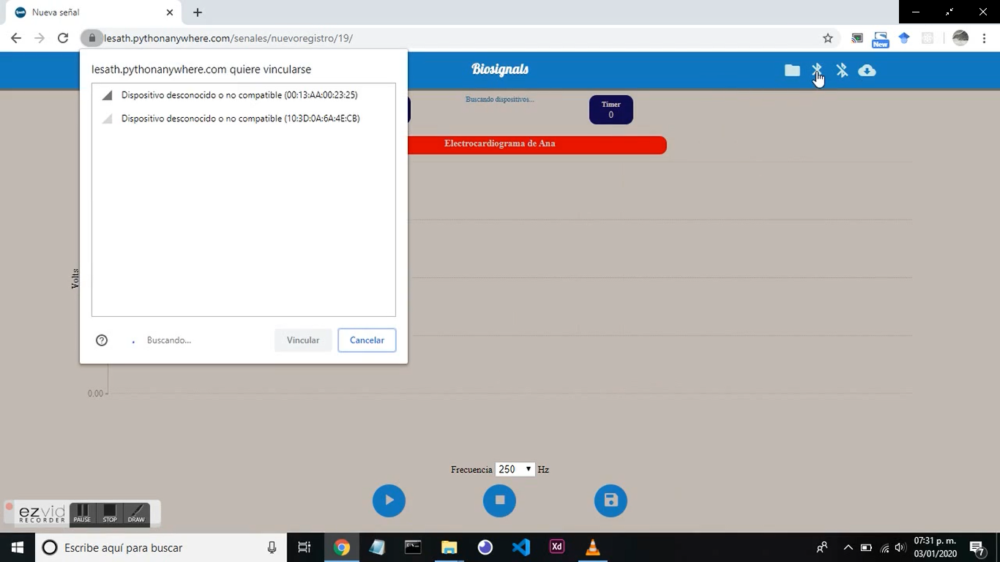

# Lesath-Biosignals
Plataforma para adquisición y análisis de bioseñales, desarrollada utilizando DJANGO.

La adquisición de las señales se basa en el API de chrome.bluetooth para conectar dispositivos bluetooth al navegador, de esta forma 
utilizando sensores conectados a un microcontrolador es posible enviar los datos al navegador, este proyecto consiste también en el 
desarrollo de sensores para registrar bioseñales, las pruebas fuerón realizadas con el microcontrolador ATMEGA328P disponible en el 
Arduino UNO y el BLE HM-10 CC2541, el script para realizar la conexión entre el microcontrolador y el módulo Bluetooth y para transmitir los datos de un sensor está disponible en otro de mis repositorios con el nombre HM10.

Para realizar la conexión es necesario que el ususario la habilite haciendo click en el icono del bluetooth, esto despliega una ventana 
que muestra los dispositvos disponibles para conectarse, después de seleccionar el dispositivo y hacer click en vincular se realiza la 
conexión entre el navegador y el dispositivo bluetooth, este proceso puede revisarse de forma simplificada en otro de mis repositorios
se encuentra con el nombre de webBT.

Las señales estan organizadas en experimentos dentro de estos los registros corresponden a señales de la misma categoría o que se tomarón 
bajo las mismas condiciones, en detalles se puede especificar esto, estos experimentos junto con las señales que contiene se pueden 
compartir con otros usuarios a través de colaboraciones que tienen las mismas características que un experimento.

Las señales que pueden registrarse por el momento corresponden a las siguientes categorías:

*Electrocardiogramas
*Fonocardiogramas
*Electromiogramas
*Actividad electrodérmica

Este proyecto integra las herramientas de procesamiento de bioseñales disponibles en la libreria de BioSppy [biosppy](https://biosppy.readthedocs.io/en/stable/), por el momento está disponible el procesamiento de electrocardiogramas, para obtener la
señal filtrada, determinar los latidos por mínuto y la variabilidad de la frecuencia cardiaca.

La aplicación cuenta con visualizaciones para 
*La señal original.

*La señal filtrada.

*La variabilidad de la frecuencia cardiaca.(HRV).

Finalmente este proyecto esta abierto para colaboraciones y poder mejorarlo, cualquier ayuda es bien resivida.

